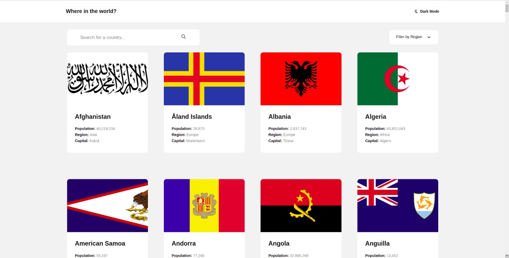
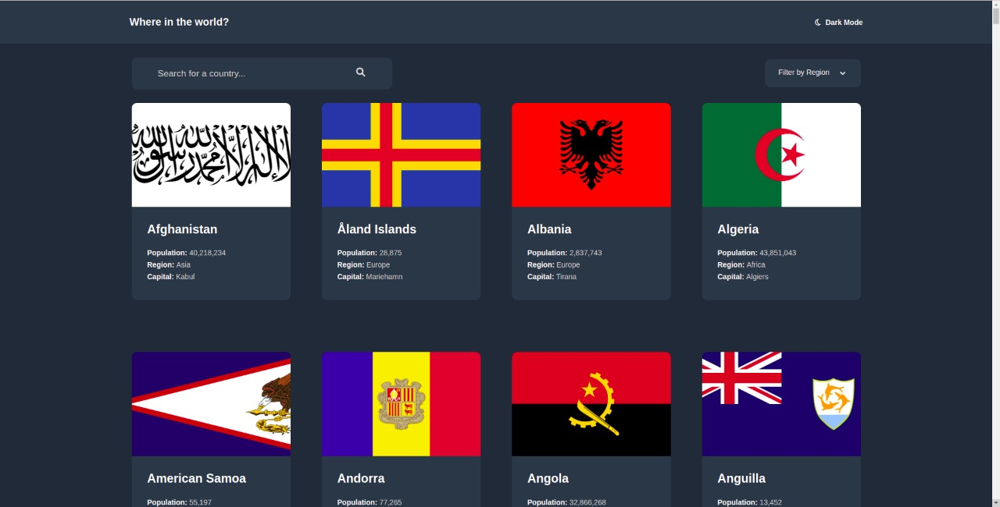

# Frontend Mentor - REST Countries API with color theme switcher solution

This is a solution to the [REST Countries API with color theme switcher challenge on Frontend Mentor](https://www.frontendmentor.io/challenges/rest-countries-api-with-color-theme-switcher-5cacc469fec04111f7b848ca). Frontend Mentor challenges help you improve your coding skills by building realistic projects. 

## Table of contents

- [Overview](#overview)
  - [The challenge](#the-challenge)
  - [Screenshot](#screenshot)
  - [Links](#links)
- [My process](#my-process)
  - [Built with](#built-with)
  - [What I learned](#what-i-learned)
  - [Useful resources](#useful-resources)
- [Author](#author)

## Overview

### The challenge

Users should be able to:

- See all countries from the API on the homepage
- Search for a country using an `input` field
- Filter countries by region
- Click on a country to see more detailed information on a separate page
- Click through to the border countries on the detail page
- Toggle the color scheme between light and dark mode

### Screenshot

### Links

- Live Site URL: [Link](https://github.com/ashel1806/country-finders)
- Solution URL: [Link](https://countries-finder-app.netlify.app/)

## My process

### Built with

- CSS custom properties
- Flexbox
- CSS Grid
- Mobile-first workflow
- [React](https://reactjs.org/) - JS library
- [Styled Components](https://styled-components.com/) - For styles
- [React Router](https://reactrouter.com/) - For UI navigation
- [Axios](https://axios-http.com/) - For fetch data from API

### What I learned

During the development of this project I learned many things, among them is to change the theme (dark mode) of the application, this using the styled-components library, which provides a component that wraps the entire application allowing all child components can access and query the current theme of the application. The theme of the application is stored in localStorage and the logic needed to switch between themes is stored in a custom hook, allowing its reusability in other parts of the app.

### Useful resources

- [Dark mode with Styled Components](https://www.smashingmagazine.com/2020/04/dark-mode-react-apps-styled-components/) - This helped me a lot to be able to implement the dark mode inside the application.

## Author

- Website - [Ashel Vasquez](https://ashel-vasquez.vercel.app/)
- Frontend Mentor - [@ashel1806](https://www.frontendmentor.io/profile/ashel1806)